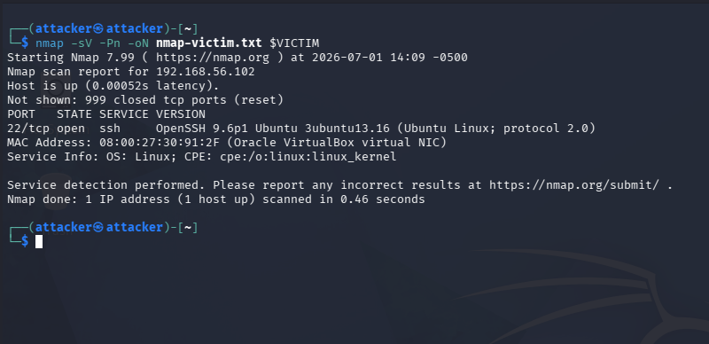
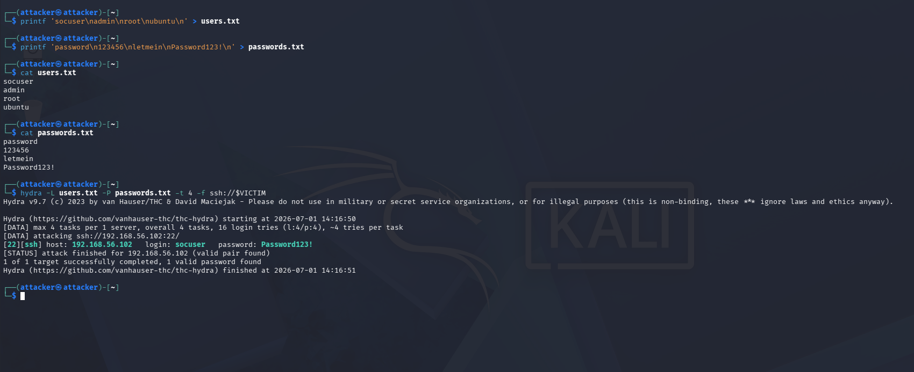
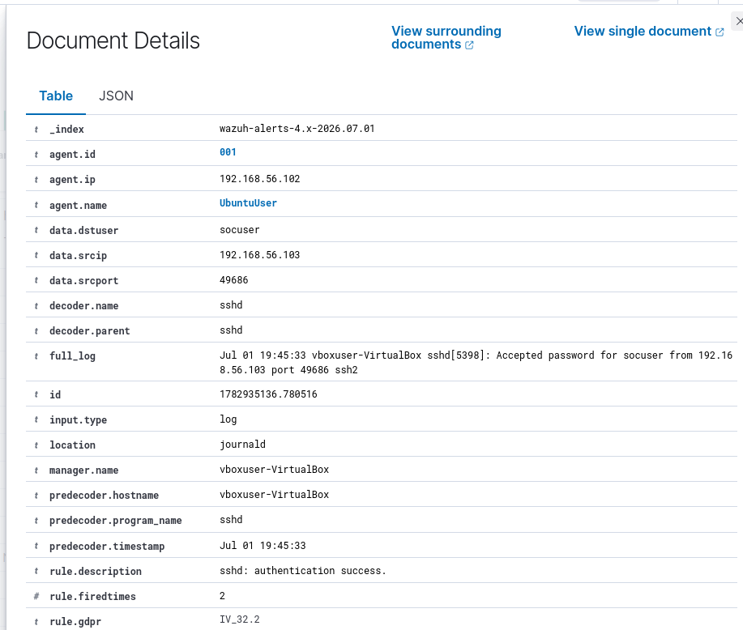
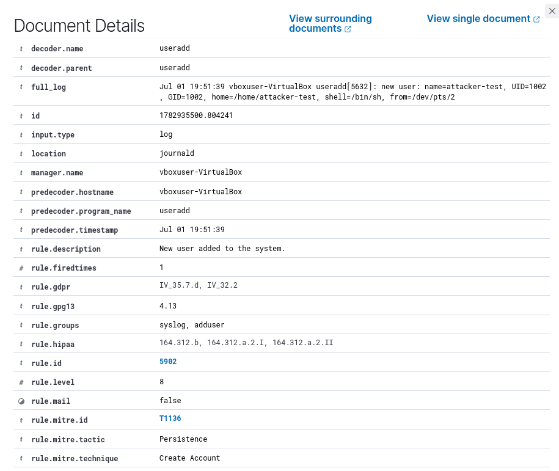
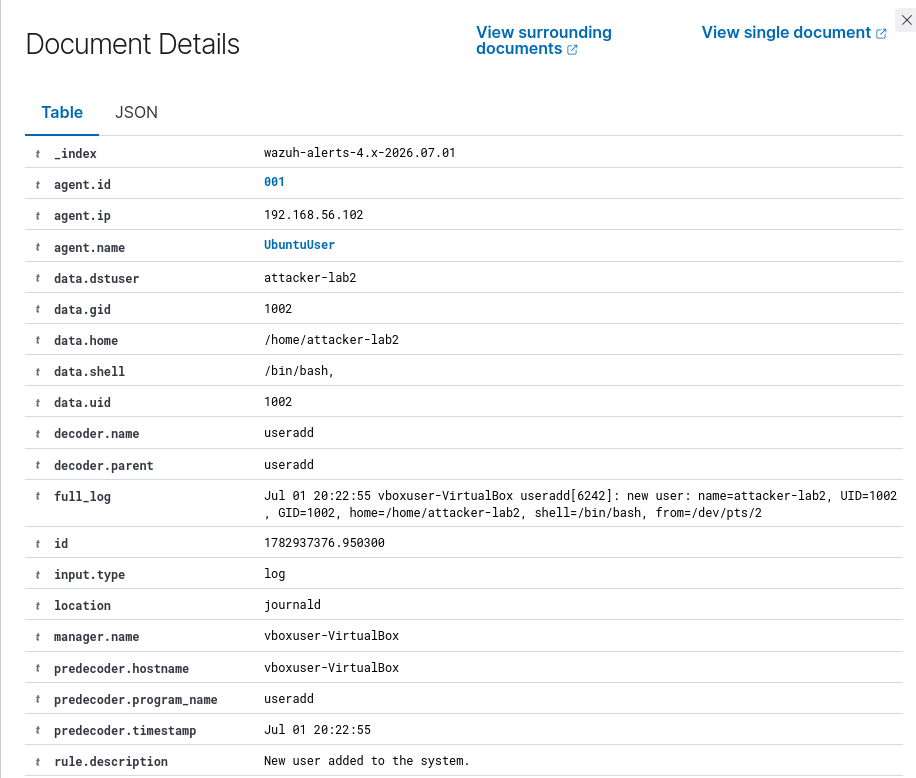
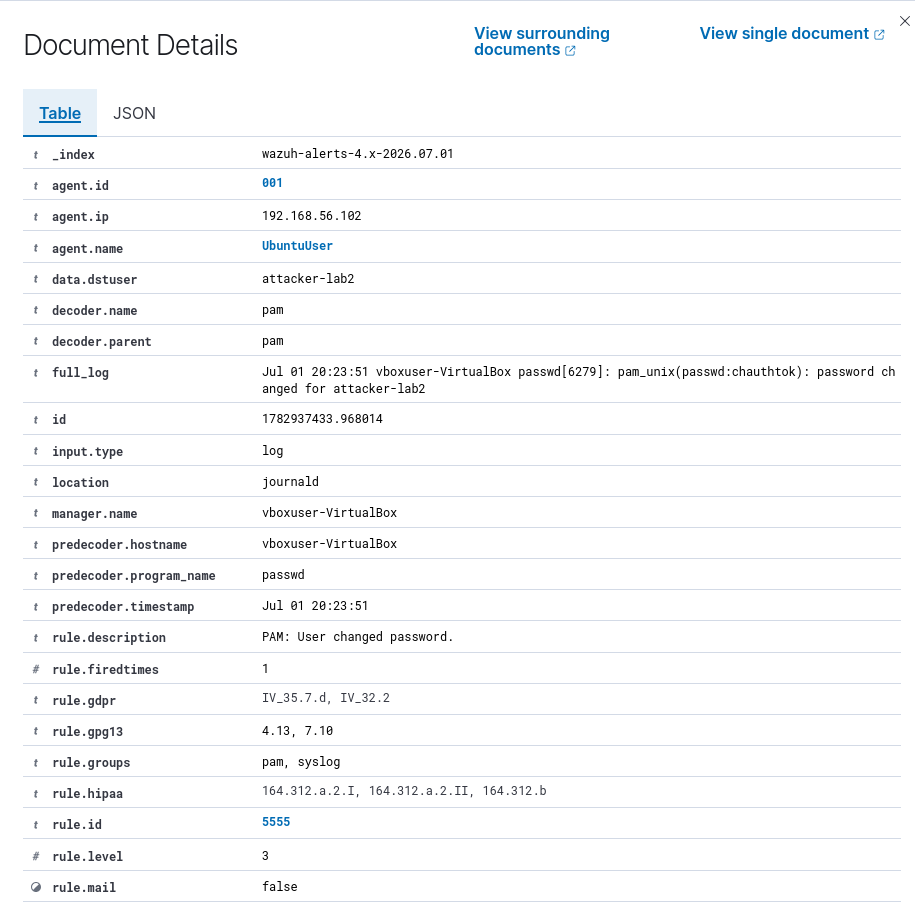
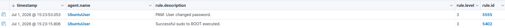

# Wazuh Linux Intrusion Detection Lab

> A hands-on SOC analyst lab where I built a small attacker/victim/SIEM environment, generated realistic Linux intrusion activity, and investigated the resulting alerts in Wazuh.

This project is not just a "tool screenshot" repo. The goal was to walk through the way an analyst thinks: **What happened? What evidence proves it? What MITRE ATT&CK behaviors does it map to? What would I do next?**

## Lab Story

I built an isolated home lab with three virtual machines:

| Role | System | Purpose |
|---|---|---|
| SIEM / Manager | Wazuh all-in-one server | Central alerting, event collection, and investigation |
| Victim Endpoint | Ubuntu Linux endpoint with Wazuh agent | Target system used to generate Linux security telemetry |
| Attacker | Kali Linux | Controlled attacker box for recon, SSH password attacks, file transfer, and post-login activity |

The lab simulated a mini intrusion chain:

1. Discover exposed services with Nmap.
2. Attempt SSH logins with bad credentials.
3. Run a controlled Hydra password guessing test.
4. Log in with a valid account.
5. Enumerate host/user information.
6. Stage files and transfer a harmless payload.
7. Simulate cron-based persistence.
8. Create and remove a suspicious local user.
9. Investigate everything in Wazuh and map activity to MITRE ATT&CK.

## Why This Lab Matters

A lot of entry-level SOC projects stop at "I installed a SIEM." This one goes further:

- I generated attack behavior from an attacker VM.
- I validated endpoint-side Linux logs.
- I confirmed alerts in Wazuh.
- I inspected `full_log`, rule descriptions, rule levels, source IPs, usernames, and MITRE mappings.
- I cleaned up the victim system after testing.

That is the difference between a dashboard demo and a real investigation workflow.


## SOC Analyst Focus

This repository is written for a SOC Analyst I / Junior Security Analyst audience. The main goal is to show that I can do more than run tools: I can collect evidence, interpret alerts, build a timeline, map behavior to ATT&CK, and explain what should happen next.

### Skills demonstrated

| SOC skill | Where it shows up in this repo | Why it matters |
|---|---|---|
| Alert triage | Wazuh Threat Hunting screenshots and `full_log` review | Separates noisy events from meaningful activity |
| Evidence validation | Cross-checking terminal activity with Wazuh alert fields | Prevents relying on screenshots without log proof |
| Timeline building | `docs/attack-timeline.md` | Shows how separate alerts become one incident story |
| Credential attack investigation | SSH failure, Hydra, and successful login evidence | Common SOC queue scenario for Linux servers |
| Post-compromise analysis | Enumeration, payload transfer, cron, and user creation phases | Helps identify what happened after initial access |
| MITRE ATT&CK mapping | `docs/mitre-attack-mapping.md` | Converts raw logs into attacker behavior language |
| Escalation writing | `templates/incident-report-template.md` | Produces a clear handoff for IR or senior analysts |
| Cleanup and validation | `docs/cleanup-notes.md` | Shows safe lab operations and endpoint hygiene |

### The SOC analyst question I answered

> Was this just normal SSH activity, or did it become a suspicious intrusion chain?

The answer came from correlation. A successful SSH login by itself can be normal. In this lab, that login followed password guessing and was followed by host enumeration, sudo usage, payload transfer, cron persistence simulation, and local account creation. That sequence is what makes the activity suspicious and worth escalation.

### What I would escalate

I would escalate this as a suspicious Linux SSH compromise because the evidence shows:

1. Authentication failures from the Kali source IP.
2. A successful SSH login for `socuser` from the same attacker-side network.
3. Post-login discovery commands.
4. Privileged activity through `sudo`.
5. Local account creation and account state changes.

Recommended escalation title:

```text
Suspicious SSH Password Guessing Followed by Valid Login and Local Account Creation on UbuntuUser
```

## Repository Layout

```text
.
├── README.md
├── docs/
│   ├── attack-timeline.md
│   ├── detection-analysis.md
│   ├── evidence-walkthrough.md
│   ├── lab-setup.md
│   ├── mitre-attack-mapping.md
│   ├── soc-analyst-focus.md
│   └── cleanup-notes.md
├── detections/
│   └── wazuh-search-queries.md
├── evidence/
│   ├── evidence-index.md
│   ├── evidence-completeness.md
│   └── screenshots/
├── scripts/
│   └── harmless-payload.sh
└── templates/
    └── incident-report-template.md
```

## Best Files for SOC Review

- [`docs/soc-analyst-focus.md`](docs/soc-analyst-focus.md) - role-relevant SOC skills, triage workflow, escalation notes, and interview talking points.
- [`docs/detection-analysis.md`](docs/detection-analysis.md) - what Wazuh saw and how I interpreted the alerts.
- [`docs/attack-timeline.md`](docs/attack-timeline.md) - attack sequence from recon to account creation.
- [`templates/incident-report-template.md`](templates/incident-report-template.md) - a SOC-style incident report format.

## High-Level ATT&CK Coverage

| Phase | Behavior | MITRE ATT&CK Mapping |
|---|---|---|
| Recon | Nmap service discovery | `T1046 - Network Service Discovery` |
| Credential Access | SSH password guessing | `T1110.001 - Password Guessing` |
| Remote Access | SSH to victim host | `T1021.004 - Remote Services: SSH` |
| Valid Login | Successful login as `socuser` | `T1078 - Valid Accounts` |
| Discovery | `whoami`, `id`, `hostname`, `uname`, `ip a` | `T1033`, `T1082` |
| Account Discovery | `/etc/passwd` review | `T1087.001 - Local Account Discovery` |
| Tool Transfer | `curl` download from Kali web server | `T1105 - Ingress Tool Transfer` |
| Execution | Running downloaded shell script | `T1059.004 - Unix Shell` |
| Persistence | Cron job simulation | `T1053.003 - Cron` |
| Account Creation | `useradd attacker-test` / `attacker-lab2` | `T1136.001 - Local Account` |
| Account Manipulation | Password lock/change and deletion | `T1098 - Account Manipulation`; `T1548.003 - Sudo and Sudo Caching` |

## Evidence Preview

### 1. Service discovery



### 2. Credential attack success



### 3. Successful SSH login in Wazuh



### 4. New user creation detected in Wazuh



### 5. Clean rerun of user creation with attacker-lab2



### 6. Account manipulation detected through PAM password change



### 7. Correlated account manipulation event rows



## Key Analyst Takeaways

- **A single successful SSH login is not automatically compromise**, but when it follows password guessing from the same source IP, it becomes much more suspicious.
- **`full_log` matters.** The original log line gives the clearest evidence of username, source IP, process, and action.
- **MITRE mapping improves communication.** It turns raw logs into recognizable attacker behaviors.
- **Detection validation matters.** Some activities are obvious in Wazuh, while others may require additional audit rules, FIM tuning, or command logging.

## Safety and Scope

This lab was performed in an isolated VirtualBox environment against systems I own/control. The commands and screenshots are for defensive education, SOC training, and portfolio documentation only.


- Built an isolated Wazuh SOC lab with Kali Linux and Ubuntu endpoint telemetry to investigate Linux intrusion activity.
- Simulated SSH password guessing, valid-account access, host enumeration, payload transfer, cron persistence, and local account creation.
- Investigated Wazuh alerts using `full_log`, rule IDs, rule levels, source IPs, usernames, and MITRE ATT&CK mappings.
- Correlated SSH failures, successful login, sudo activity, and local account creation into a SOC-style incident timeline with containment recommendations.
