# Evidence Walkthrough

This file embeds the screenshots in the same order as the lab timeline. Each image is tied to the behavior it proves and the MITRE ATT&CK mapping it supports.

## 1. Nmap service discovery against Ubuntu victim

**Phase:** Reconnaissance / Discovery  
**MITRE:** T1046 - Network Service Discovery

## 2. Manual SSH failed login loop

**Phase:** Credential Access  
**MITRE:** T1110.001 - Password Guessing; T1021.004 - SSH

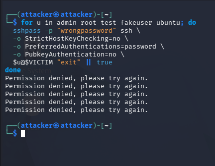

## 3. Hydra SSH password attack success

**Phase:** Credential Access / Initial Access  
**MITRE:** T1110.001 - Password Guessing; T1021.004 - SSH; T1078 - Valid Accounts

## 4. Valid SSH login and host enumeration

**Phase:** Initial Access / Discovery  
**MITRE:** T1078 - Valid Accounts; T1021.004 - SSH; T1082 - System Information Discovery; T1033 - System Owner/User Discovery

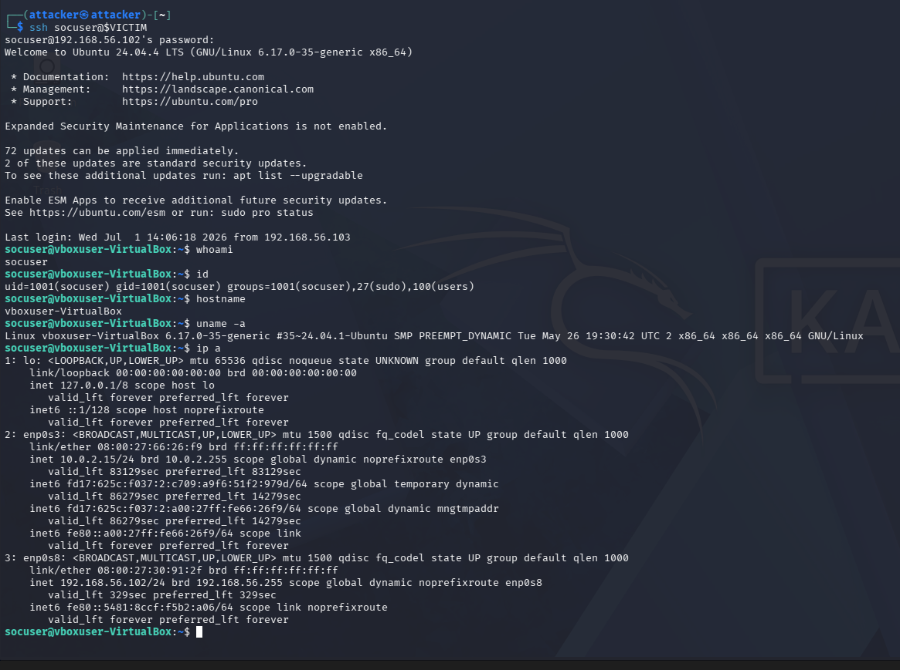

## 5. Account discovery through /etc/passwd

**Phase:** Discovery  
**MITRE:** T1087.001 - Local Account Discovery

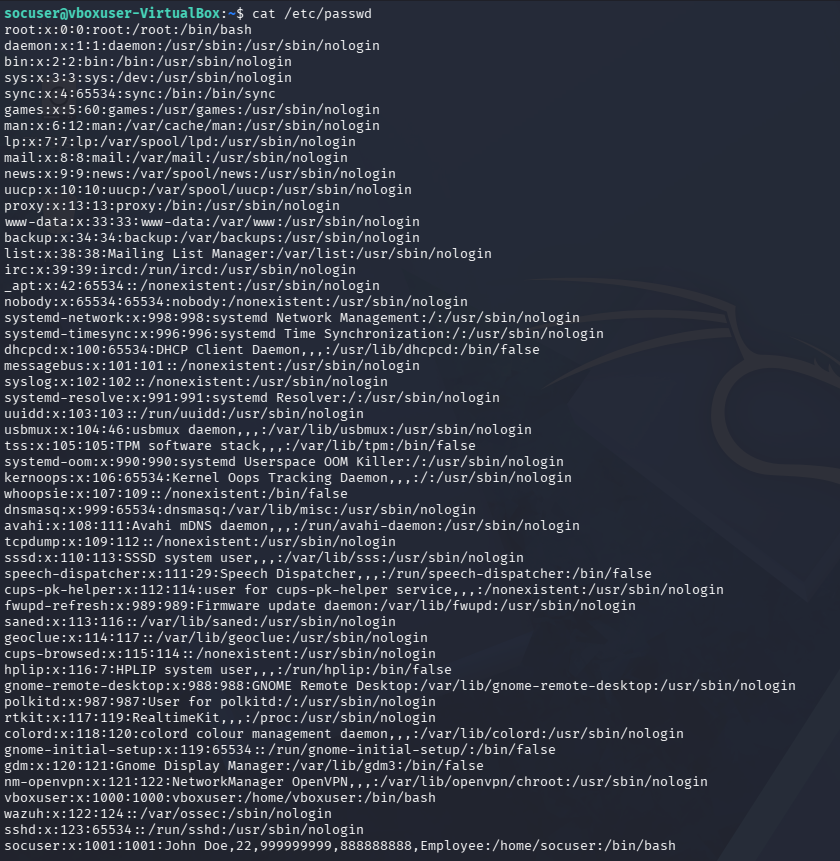

## 6. Confirmed socuser account entry in /etc/passwd

**Phase:** Discovery  
**MITRE:** T1087.001 - Local Account Discovery

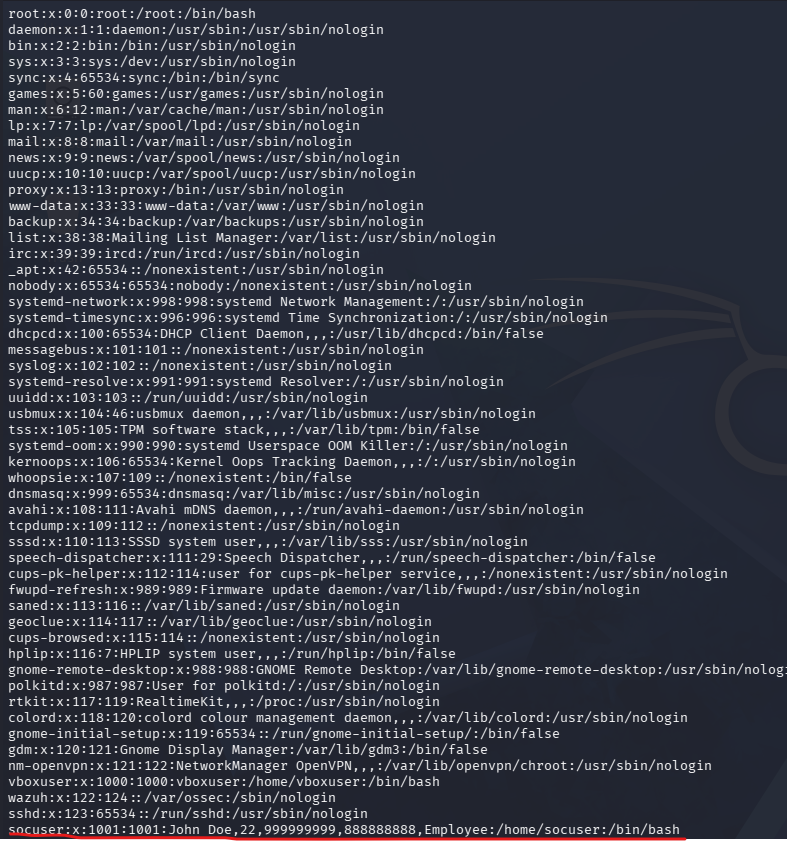

## 7. Sudo privilege check

**Phase:** Discovery / Privilege Context  
**MITRE:** T1069.003 - Permission Groups Discovery: Local Groups; T1033 - System Owner/User Discovery

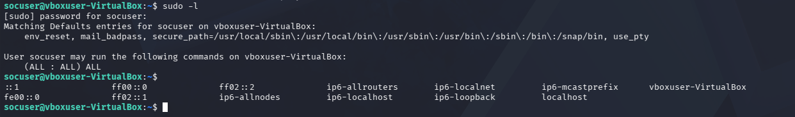

## 8. Harmless payload script prepared on Kali

**Phase:** Staging  
**MITRE:** T1105 - Ingress Tool Transfer preparation

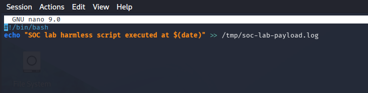

## 9. Payload transfer and execution via curl

**Phase:** Command and Control / Execution  
**MITRE:** T1105 - Ingress Tool Transfer; T1059.004 - Unix Shell

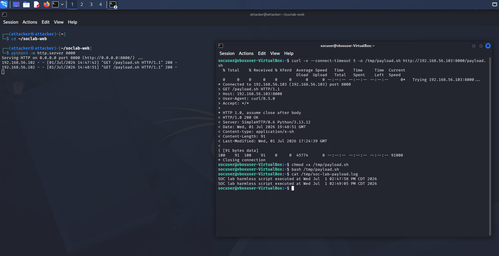

## 10. Cron persistence simulation

**Phase:** Persistence  
**MITRE:** T1053.003 - Scheduled Task/Job: Cron

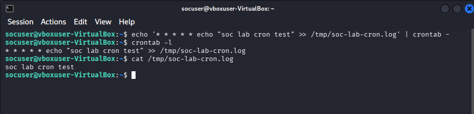

## 11. User creation, password lock, and deletion

**Phase:** Persistence / Account Manipulation  
**MITRE:** T1136.001 - Create Account: Local Account; T1098 - Account Manipulation

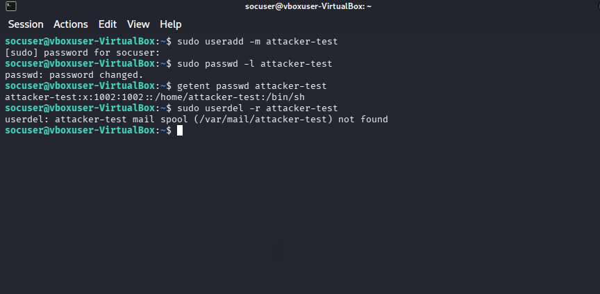

## 12. Wazuh threat hunting overview for UbuntuUser

**Phase:** SIEM Triage  
**MITRE:** Multiple detections across the intrusion chain

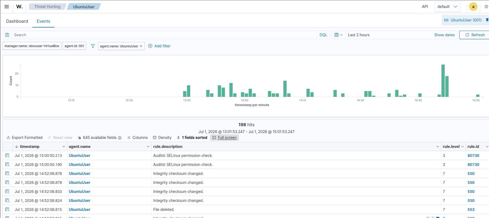

## 13. Wazuh SSH search results

**Phase:** SIEM Triage  
**MITRE:** T1110.001; T1021.004; T1078

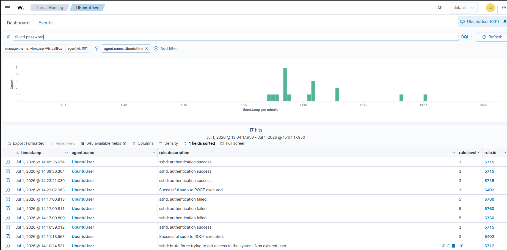

## 14. Wazuh SSH authentication success rule details

**Phase:** Detection Engineering Context  
**MITRE:** T1078 - Valid Accounts; T1021 - Remote Services

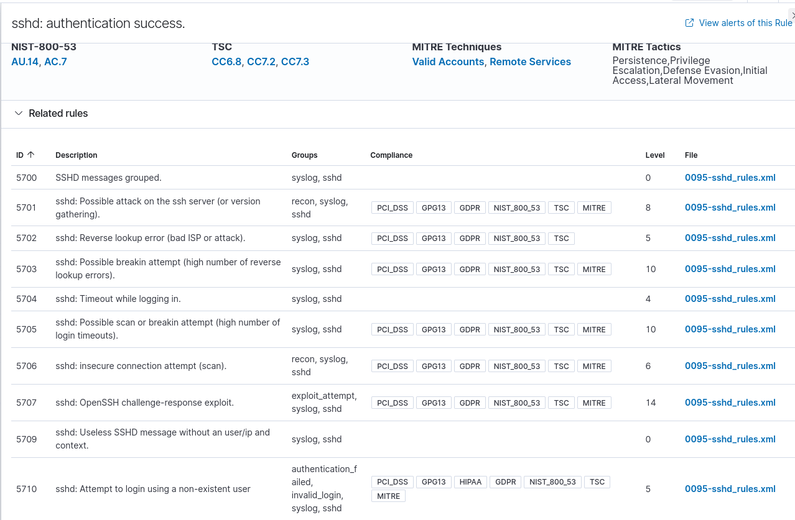

## 15. Wazuh full_log for successful SSH login

**Phase:** Alert Investigation  
**MITRE:** T1078 - Valid Accounts; T1021.004 - SSH

## 16. Wazuh failed authentication rows

**Phase:** Alert Investigation  
**MITRE:** T1110.001 - Password Guessing; T1021.004 - SSH

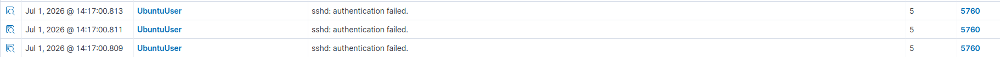

## 17. Wazuh failed SSH document details with MITRE mapping

**Phase:** Alert Investigation  
**MITRE:** T1110.001 - Password Guessing; T1021.004 - SSH

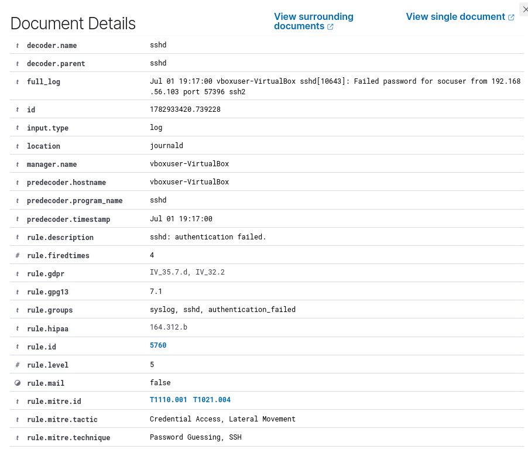

## 18. Wazuh successful SSH document details with MITRE mapping

**Phase:** Alert Investigation  
**MITRE:** T1078 - Valid Accounts; T1021 - Remote Services

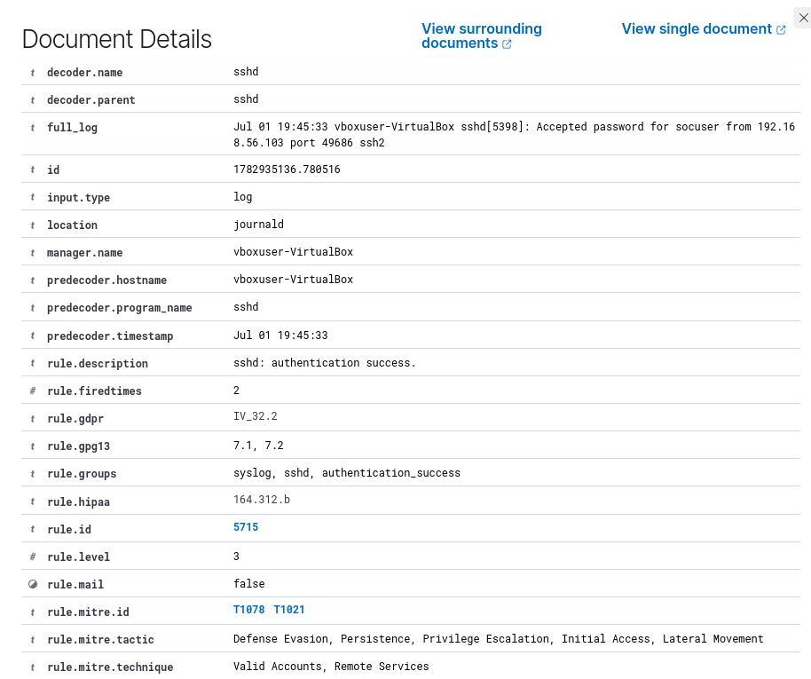

## 19. Wazuh related rule reference review

**Phase:** Rule Validation  
**MITRE:** Analyst validation: rule context review, not primary evidence

> Analyst note: this screenshot is included as a rule-context review. It is not used as primary evidence for the attack chain; it shows why analysts validate rule context instead of blindly trusting titles.

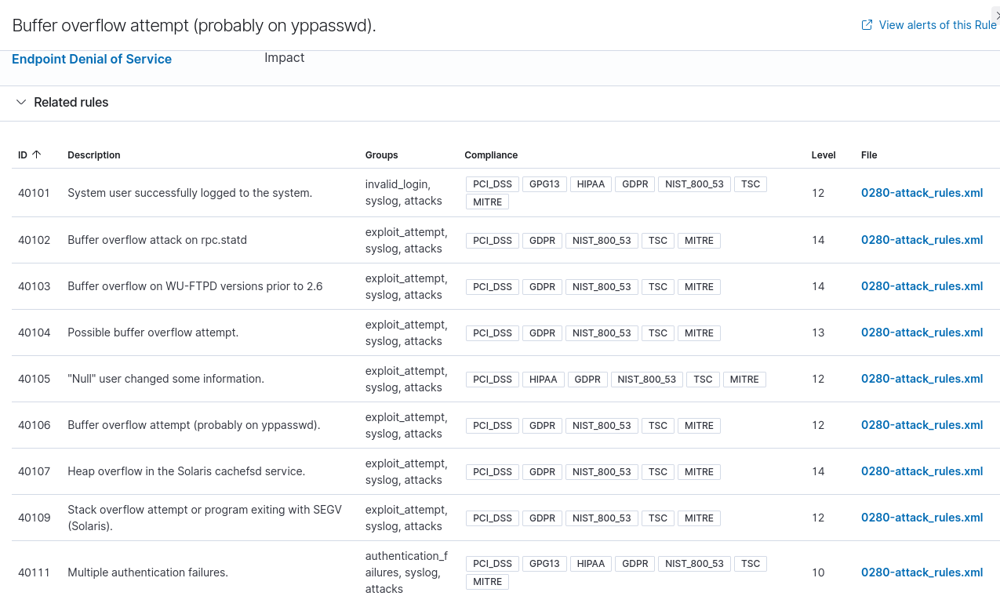

## 20. Wazuh useradd alert details

**Phase:** Persistence Detection  
**MITRE:** T1136 - Create Account

## 21. Wazuh useradd alert details - clean rerun with attacker-lab2

**Phase:** Persistence Detection / Account Creation  
**MITRE:** T1136.001 - Create Account: Local Account

This screenshot was added after rerunning the user creation phase with a new account name, `attacker-lab2`, so the Wazuh evidence was easy to isolate. The alert shows the original `useradd` log content, including the destination user, UID/GID, home directory, shell, agent, and manager.

## 22. Wazuh password change alert details for attacker-lab2

**Phase:** Account Manipulation  
**MITRE:** T1098 - Account Manipulation

After the local account was created, the account state was modified with `passwd -l attacker-lab2`. Wazuh recorded this as `PAM: User changed password.` Even though this was a controlled lock operation in the lab, the detection is useful because real intrusions often include account state changes, credential resets, account enabling/disabling, or persistence-related identity manipulation.

## 23. Wazuh account manipulation event rows

**Phase:** Alert Correlation / Timeline Validation  
**MITRE:** T1098 - Account Manipulation; T1548.003 - Abuse Elevation Control Mechanism: Sudo and Sudo Caching

This screenshot shows the Wazuh event rows around the account manipulation activity, including `PAM: User changed password` and `Successful sudo to ROOT executed`. This is useful for analyst correlation because it connects the privileged action to the identity change. In a real investigation, these rows would help answer: who ran the command, when did it happen, and what happened immediately before or after?

## SOC Analyst Evidence Priority

For a SOC Analyst portfolio review, prioritize these screenshots:

1. `15_wazuh_successful_ssh_full_log.png` - best proof of successful access.
2. `17_wazuh_failed_ssh_mitre_details.png` - best proof of password guessing detection and MITRE mapping.
3. `20_wazuh_useradd_create_account_details.png` - best proof of local account creation.
4. `21_wazuh_useradd_attacker_lab2_details.png` - clean rerun of account creation with easy-to-isolate evidence.
5. `22_wazuh_password_change_attacker_lab2_details.png` - account state/password manipulation evidence.
6. `23_wazuh_account_manipulation_event_rows.png` - correlation of PAM and sudo activity.

These screenshots demonstrate core SOC skills: alert review, evidence validation, timeline correlation, and escalation judgment.
